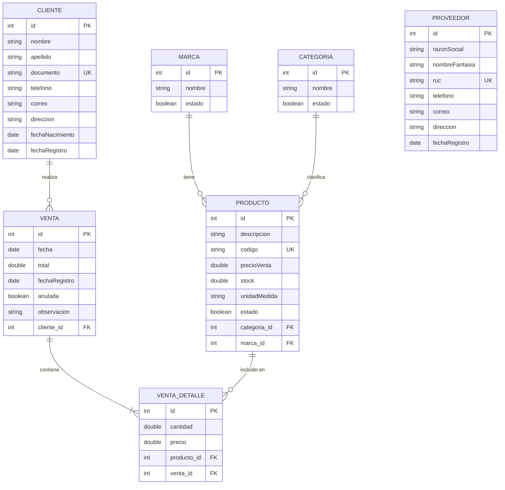

# Diagrama de Entidad y Relación — Ferretería San Martín (Sistema de Ventas)

Este diagrama refleja las entidades reales del código (`src/main/java/modelo`),
adaptadas al contexto de una ferretería.

## Notas sobre los cambios respecto al diagrama original

- **`funcionario` → no existe en el código actual.** El código real no tiene
  esa entidad; en su lugar existe `PROVEEDOR`, que hoy es un catálogo
  independiente (sin relación directa con `PRODUCTO` todavía).
- **`ProductoModelo`** ahora incluye `stock` y `unidadMedida` (unidad, kg,
  metro, bolsa, rollo, etc.), útil para artículos de ferretería que se venden
  por peso, longitud o packs.
- **`ClienteModelo`** incluye `fechaNacimiento` y `fechaRegistro`, además de
  los campos de contacto.
- **`VentaModelo`** incluye `anulada` (para anular una venta) y
  `observacion` (texto libre), y se relaciona 1—N con `VENTA_DETALLE`.
- Los nombres de tabla reales (anotación `@Entity(name=...)`) son:
  `tb_categorias`, `tb_clientes`, `tb_marcas`, `tb_productos`,
  `tb_proveedores`, `tb_ventas`, `tb_venta_detalle`.
